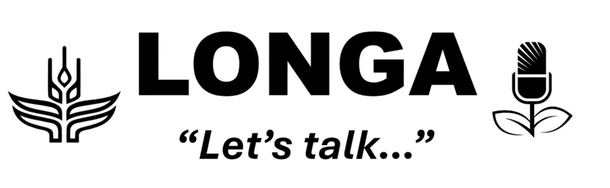
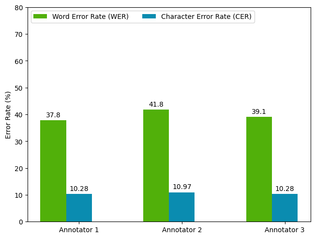

# Speech Recognition for Low Resource Languages

 
### Overview

This repo contains the codebase for [LONGA](https://cgspace.cgiar.org/items/b1acbc87-6f13-4911-b087-03076254d8c2)--a speech recognition tool designed for transcription of low resource, particularly Bantu, Languages. The tool was initially designed for Speech-to-Text (STT) processing of Luganda, and more recently Bambara, but the code in this repo tries to generalize adaptation of the tool for any (low resource) language.

## Speech Recognition Data 
Data used in training and evaluating the speech recognition models was sourced from radio recordings collected by [Farm Radio International (FRI)](https://farmradio.org/). Speech data from both the Luganda and Bambara Languages was annotated with the help of native speakers, trained and supervised by the FRI team. The annotated data was then cleaned and processed using the scripts in [data](/data/).  

### Data Annotation
The annotation process for both languages involved native speakers trained using a [transcription guide](https://zenodo.org/records/5855017) prepared by the Makerere AI Lab along with a video tutorial illustrating how to properly use the guide and annotation software. Manual transcription of audio recordings used to train and evaluate the ASR models was also carried out using [ELAN](https://archive.mpi.nl/tla/elan)–an annotation tool for audio and video recordings from the Max Planck Institute for Psycholinguistics. 

### Preliminary Tests and Benchmarks
For Luganda, tests were conducted using a sample of The Makerere Radio Speech Corpus where annotators were trained to transcribe a few audio samples following the transcription guide and were each thereafter required to prepare transcriptions for about 25 test set samples. The annotated test samples were then evaluated against the original transcriptions from the speech corpus using the Word Error Rate (WER) of the transcriptions. 



Preliminary test results helped establish a benchmark for the Luganda model, where an average WER score of 39.59% obtained from human transcriptions was set as a baseline against which performance of the Luganda ASR models would be measured. 

## Experiments
The scripts in this repo contain all the classes and methods used in the original work, along with instructions on how to replicate the results obtained in the experiments. This work made use of pretrained models, with primary focus on the [Whisper model](https://openai.com/index/whisper/)–a transformer model trained on over 600 hours of speech data, and covering 99 languages. Moreover following [results from previous work](https://cgspace.cgiar.org/items/b1acbc87-6f13-4911-b087-03076254d8c2), the work tested several transducer models from [Nvidia’s NeMo catalog](https://docs.nvidia.com/nemo-framework/user-guide/latest/nemotoolkit/asr/results.html#automatic-speech-recognition-models).

### Whisper
The Luganda model made use of Whisper larger V3 model finetuned by [Sunbird AI](https://sunbird.ai/portfolio/african-languages/)–an initiative focused on building Natural Language Processing technologies to provide language resources for social good. The [Sunbird African Language Technology (SALT)](https://huggingface.co/Sunbird/asr-whisper-large-v3-salt) model was trained primarily for Ugandan languages making use of the [SALT dataset](https://huggingface.co/datasets/Sunbird/salt) along with open source data including data from Makerere University.

The Bambara Whisper model was finetuned from the original Whisper medium, using the pretrained Hausa model. Model performance was measured and compared to results from existing research including work by [Aboubacar OUATTARA](https://huggingface.co/oza75/whisper-bambara-asr-002) and a [study by American researchers presented in the 2024 Interspeech Conference](https://www.isca-archive.org/interspeech_2024/tapo24_interspeech.pdf).

### Nvidia NeMo
This work made use of transducer and conformer models using checkpoints from models pretrained on open source data. Models tested include [a multilingual model](https://openreview.net/pdf?id=tuUHjowTKpC) from [MbazaNLP](https://huggingface.co/mbazaNLP)–a community working on Natural Language Processing for Kinyarwanda and other low-resource languages–trained on Kinyarwanda, Swahili, and Luganda speech data, as well as pretrained Bambara models from [RobotsMali](https://robotsmali.org/en/)–an initiative focused on improving access to emerging robotics and AI technologies in Mali and West Africa.

Along with finetuning pretrained models, Nvidia’s Neural Modules (NeMo), coupled with the encoder-decoder nature of models used, allowed for more modular transfer learning where weights from the encoder of one architecture can be attached to the decoder of another. This enables incorporating knowledge learned from acoustic patterns of one model into a model with a different decoder size or architecture, thus enhancing the attributes of both and improving overall model performance.

## Model Training
Both the Whisper and NeMo models were trained using [Google Colab](https://colab.research.google.com/)–a hosted Jupyter Notebook service that provides free access to computing resources. All experiments were carried out in a GPU runtime environment using a single Nvidia A100 GPU with 40GB of VRAM. The NeMo models were trained for a maximum of 250 epochs with an early stopping callback that ended training if the validation set WER stopped improving for 10 epochs while the Whisper models were trained for a maximum of 10,000 steps.

Results from the original work can be replicated using command line script as illustrated below:

```bash
# whisper model
python train.py \
    --config-path=<path to config> \
    --config-name<name of config without .yaml> \
    model.pretrained_model=<name of model from Hugging Face> \
    model.language=<pretrained tokenizer language to use> \
    dataset.train_manifest=<path to train manifest> \
    dataset.val_manifest=<path to validation manifest> \
    dataset.test_manifest=<path to test manifest>

# NeMo model
python train.py \
    --config-path=<path to config> \
    --config-name<name of config without .yaml> \
    model.tokenizer_dir=<path to tokenizer> \
    model.train_ds.manifest_filepath=<path to train manifest> \
    model.validation_ds.manifest_filepath=<path to validation manifest> \
    model.test_ds.manifest_filepath=<path to test manifest> 
```
