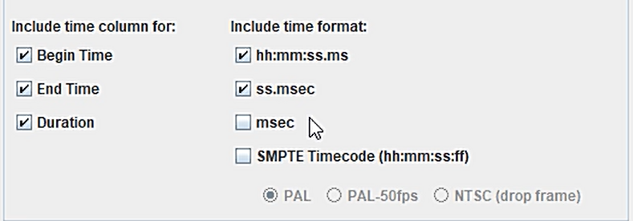

## Data Cleaning
The *transcripts.py* script contains code used in processing transcriptions obtained from ELAN. The methods in the script can be used to:
1. Read and process csv files exported using ELAN
2. Summarize the audio and text information for the annotated data

It should be noted that the preprocessing steps are dependent on the exported ELAN file, and the code in this repo was designed to work with the export format containing the columns below:



The sample code block below can be used to process an exported csv file

```python
from data.transcripts import read_transcriptions, insert_ids

data_path = "path/to/transcriptions"
cols = ['Tier', 'Begin Time - hh:mm:ss.ms', 'Begin Time - ss.msec',
        'End Time - hh:mm:ss.ms', 'End Time - ss.msec', 'Duration - hh:mm:ss.ms',
        'Duration - ss.msec', 'text']

#optional
rename_cols = {"Temps de départ - hh:mm:ss.ms":'Begin Time - hh:mm:ss.ms',
        "Temps de départ - ss.msec":'Begin Time - ss.msec',
        "temps de fin - hh:mm:ss.ms":'End Time - hh:mm:ss.ms',
        "temps de fin - ss.msec":'End Time - ss.msec',
        "Durée - hh:mm:ss.ms":'Duration - hh:mm:ss.ms',
        "Durée - ss.msec":'Duration - ss.msec',
        "default":'text'}
drop_cols = ['Temps de départ - msec', 'temps de fin - msec', 'Durée - msec', 
"Temps de départ - PAL", "temps de fin - PAL", "Durée - PAL"]

annotator1 = read_transcriptions(
        data_path = data_path,
        cols = cols,     
        sample_col = 'Duration - ss.msec',
        replace_header = True, #must specify replace_cols
        rename_cols = rename_cols, #optional unless replace_header is True
        drop_cols = drop_cols #optional
        )

annotator1 = insert_ids(annotator1, 'an1')

annotator1.to_csv("/path/to/store/transcripts", index=False)

```

The transcriptions output should be a dataframe with a structure similar to the one below

| Begin Time - hh:mm:ss.ms | Begin Time - ss.msec | ... | text | audio_name |
| -------------------------| -------------------- | --- | ---- | ---------- |
| 00:00:01.400 | 1.40 | ... | Ne tɔgɔ ye  | 60c8bd2911de30 |
| 00:06:04.080 | 364.080 | ... | kyenda mu musanvu akasirise satu ffe mwe mwe f... | R4OSP |

The transcription summary can be obtained using the following code block and should output the table below

```python
import pandas as pd
from data.transcripts import build_summary_dict

annotator_summary = pd.DataFrame(
    build_summary_dict(
        data=annotator1,
        audio_data_path="/path/to/audio/data",
        annotator="annotator's name or ID",
    ))
```

| Annotator | Total Transcribed Audio (hours) | ... | Total Transcription (CSV) Files Submitted |
| --------- | ------------------------------- | --- | ----------------------------------------- |
| Annotator1 | 5.76 | ... | 280 |
| Annotator2 | 7.41 | ... | 886 |

## Audio Data Preparation
Once the transcriptions obtained from ELAN are cleaned and in a uniform format, the merged datasets can then used to prepare audio files by splitting the recordings according to segments identified using “Begin Time - ss.msec” and “End Time - ss.msec” from the transcription data. These segments, as emphasized in the guidelines, ensure audio clips are on average no longer than 30 seconds. Following the split, the clips can then be resampled to 16kHz and converted into the .wav format as required by speech recognition models, particularly those used in this work.

Code in *audio.py* can be used to segment and process audio files as illustrated below

```python
from data.audio import prepare_audio_files, get_audio_ids

dfs = [annotator1, annotator2, annotator3]
paths = [annotator1_paths, annotator2_paths, annotator3_paths]

mp3_paths = [f'{pth}/**/*[a-zA-Z0-9].mp3' for pth in paths]
wav_paths = [f'{pth}/**/*[a-zA-Z0-9].wav' for pth in paths]

#saves the segmented audio files to the output directory
prepare_audio_files(
    dfs=dfs,
    paths=paths,
    output_path="path/to/output/directory"
    format="wav" #or mp3, run twice changing the parameter if folder contains both file formats
)
```

## Train-Test Split
The code in the *preprocessing.py* script can be used to split the data into the train, validation, and test sets which are used in training and evaluating the ASR models. The code can also be used to further create manifest files for [Nvidia NeMo models](https://docs.nvidia.com/nemo-framework/user-guide/latest/nemotoolkit/asr/intro.html) as well as decode and resample the audio files.

```python
from data.preprocessing import prepare_transcript_data,  dataset_split, process_data

train_df = "/path/to/train/data", 
val_df = "/path/to/validation/data", 
test_df = "/path/to/test/data", 

origin_dir = '/path/to/audio/clips',
destination_dir = "/path/to/save/decoded/audio/files"

drop_cols = ['Tier', 'Begin Time - hh:mm:ss.ms', 'Begin Time - ss.msec',
             'End Time - hh:mm:ss.ms', 'End Time - ss.msec', 'audio_name', 'pth', 
             'Begin Time - msec', 'Begin Time - PAL', 'End Time - msec', 'End Time - PAL', 
             'Duration - msec', 'Duration - PAL', 'default', 'Duration - hh:mm:ss.ms']

transcript = prepare_transcript_data("/path/to/transcripts", 
                                     drop_cols, 
                                     "/path/to/audio/clips")

#saves the split transcriptions to folder
train, val, test = dataset_split(
        data=transcript,
        transcript_col="sentence",
        audio_files_dir="/path/to/audio/clips",
        save_path="/path/to/save/transcription/splits",
        return_splits=True
    )

#process text data and save manifests
train_manifest = process_data(train_df, origin_dir, destination_dir, -1, True)
val_manifest = process_data(val_df, origin_dir, destination_dir, -1, True)
test_manifest = process_data(test_df, origin_dir, destination_dir, -1, True)
```
